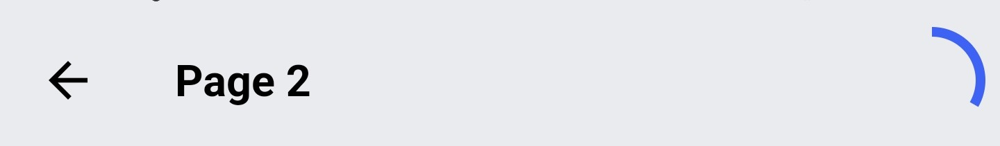

# Pageview Form

Pageview Form is a Flutter package that allows you to create a form with a page view and a progress bar. This package makes it easy to create interactive and customizable forms with seamless navigation between pages.

## Demo


Circular indicator:


Linear indicator:


## Platforms supported

| Android | iOS | Web | MacOS | Windows | Linux |
|:-------:|:---:|:---:|:-----:|:-------:|:-----:|
|✅|✅|✅|✅|✅|✅|

## Features

- Create a form with a page view and a progress bar
- Navigate between pages using the progress bar or the back button
- Customize the appearance of the form
- Customize the progress indicator
- Customize the button widget

## Installation

Add the following dependency to your `pubspec.yaml` file:

```yaml
dependencies:
  pageview_form: ^1.0.0
```

Import the package in your Dart file:

```dart
import 'package:pageview_form/pageview_form.dart';
```

## Usage

Create a list of page models (**'PageFormModel'**) to define the pages in your form. Each page model should contain a **'formKey'** for form validation and a **'form'** that represents the page content.

```dart
final List<PageFormModel> pages = [
  PageFormModel(
    formKey: GlobalKey<FormState>(),
    form: YourFormWidget(),
    title: 'Page 1',
    textButton: 'Next',
  ),
  // Add other page models here
];
```

Next, create a **PageController** to control the navigation between pages:

```dart
final PageController _pageController = PageController();
```

Use the **'PageviewForm'** widget by providing it with the pages, the function to execute when the form is submitted, and other optional parameters to customize the appearance and behavior of the form:

```dart
PageviewForm(
  progress: ProgressIndicatorType.linear,
  pages: pages,
  onFormSubmitted: () {
    // Function to execute when the form is submitted
  },
  controller: _pageController,
),
```

Refer to the provided usage **'examples'** in the example folder for more details.

## Parameters

| Parameter | Type | Description |
|-----------|------|-------------|
| progress | ProgressIndicatorType? | Optional. Specifies the type of progress indicator to use. Default is `ProgressIndicatorType.linear`. |
| pages | List\<PageModel> | Required. The list of page models that define the pages in the form. |
| onFormSubmitted | Function() | Required. The function to execute when the form is submitted. |
| padding | EdgeInsetsGeometry? | Optional. The padding around the form widget. |
| backgroundColor | Color? | Optional. The background color of the form widget. |
| buttonStyle | ButtonStyle? | Optional. The style of the button widget. |
| buttonHeight | double? | Optional. The height of the button widget. Default is `50`. |
| buttonWidth | double? | Optional. The width of the button widget. Default is `double.infinity`. |
| buttonTextStyle | TextStyle? | Optional. The text style of the button widget. |
| showAppBar | bool? | Optional. Specifies whether to show the app bar. Default is `true`. |
| showBackButton | bool? | Optional. Specifies whether to show the back button on the app bar. Default is `true`. |
| appBarCenterTitle | bool? | Optional. Specifies whether to center the title on the app bar. Default is `false`. |
| appBarElevation | double? | Optional. The elevation of the app bar. Default is `4`. |
| appBarBackgroundColor | Color? | Optional. The background color of the app bar. Default is `Colors.white`. |
| appBarHeight | double? | Optional. The height of the app bar. Default is `56`. |
| progressIndicatorColor | Color? | Optional. The color of the progress indicator. If not specified, it uses the primary color of the theme. |
| progressIndicatorBackgroundColor | Color? | Optional. The background color of the progress indicator. Default is `Colors.grey[300]`. |
| progressIndicatorSize | double? | Optional. The size of the progress indicator. Default is `40`. |
| progressIndicatorStrokeWidth | double? | Optional. The stroke width of the progress indicator. Default is `4`. |
| controller | PageController | Required. The page controller for controlling the navigation in the pages. |


## Customization

### Form widget

You can customize the form widget by providing the following parameters:

- **'padding'**: The padding around the form widget.
- **'backgroundColor'**: The background color of the form widget.

### App bar

You can customize the app bar by providing the following parameters:

- **'showAppBar'**: Specifies whether to show the app bar. Default is `true`.
- **'showBackButton'**: Specifies whether to show the back button on the app bar. Default is `true`.
- **'appBarCenterTitle'**: Specifies whether to center the title on the app bar. Default is `false`.
- **'appBarElevation'**: The elevation of the app bar. Default is `4`.
- **'appBarBackgroundColor'**: The background color of the app bar. Default is `Colors.white`.
- **'appBarHeight'**: The height of the app bar. Default is `56`.

### Progress indicator

You can customize the progress indicator by providing a **'ProgressIndicatorType'** to the **'progress'** parameter. The following types are available:

- **ProgressIndicatorType.linear**: A linear progress indicator that fills the progress bar as the user navigates between pages.
- **ProgressIndicatorType.circular**: A circular progress indicator that fills the progress bar as the user navigates between pages.

### Button widget

You can customize the button widget by providing a **'ButtonStyle'** to the **'buttonStyle'** parameter. This allows you to customize the button widget with any style you want.

You can also customize the button widget by providing the following parameters:

- **'buttonHeight'**: The height of the button widget. Default is `50`.
- **'buttonWidth'**: The width of the button widget. Default is `double.infinity`.
- **'buttonTextStyle'**: The text style of the button widget.

## Authors

- [@juju149](https://www.github.com/juju149)

